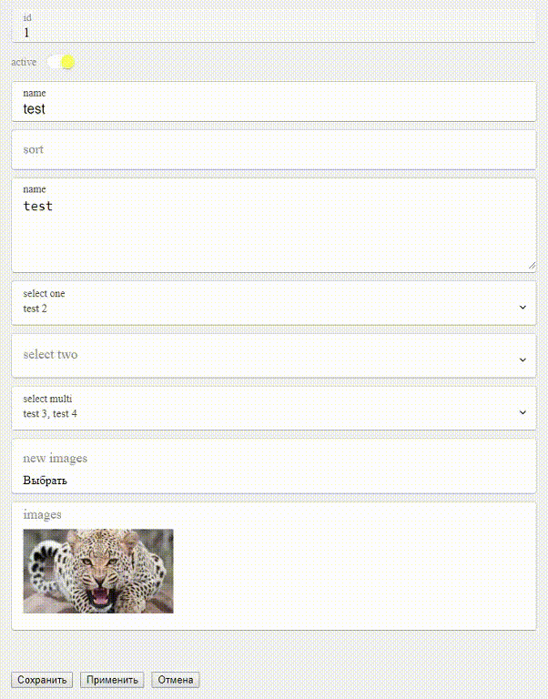
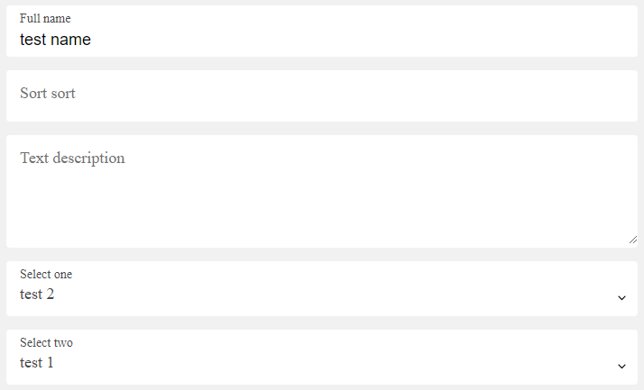

## install

npm i vue-ui-form --save-dev

## use

```html
<form-interface
    title="DEMO"
    :data="formData"
    :errors="formErrors"
    :processing="formProcessing"
    :buttons="buttons"
    :buttonsClass="btn"
    @save="saveForm" 
    @apply="applyForm"
    @cancel="cancelForm">
    
    <div slot="desc_before">description before form</div>
    <div slot="desc_after">description after form</div>
    <div slot="processing">Sending :)</div>
    
    <form-view title="id" v-model="formData.id"></form-view>
    
    <form-view title="with slot">
        default slot data
    </form-view>
    
    <form-checkbox title="active" v-model="formData.active" error-сode="active">
        <div slot="label-hint">help info</div>
        <div slot="hint">name of ...</div>
    </form-checkbox>
    
    <form-input title="name" v-model="formData.name" error-сode="name"></form-input>
    <form-text title="description" v-model="formData.description" error-сode="description"></form-text>
    
    <form-view title="add file">
        <form-file 
            v-model="formData.file"> 
        </form-file>
    </form-view>
    
    <form-view title="add files">
        <form-file 
            :multiple="true"
            v-model="formData.files"> 
            <template slot="file" slot-scope="file">
                {{ file }}
            </template>
        </form-file>
    </form-view>
    
    <form-view title="images">
        <form-view-images 
            v-model="formData.image_view" 
            @remove="removeImage">
            <template slot="file" slot-scope="file">
                {{ file }}
            </template>
        </form-view-images>
        <div slot="label-hint">images info</div>
        <div slot="hint">images of ...</div>
    </form-view>
    
    <form-view title="files">
        <form-view-files 
            v-model="formData.image_view" 
            @remove="removeFile">
            <template slot="file" slot-scope="file">
                {{ file }}
            </template>
        </form-view-files>
    </form-view>
    

</form-interface>
```



### form-interface properties
| Name   | Type  | Required | Default | Description |
| ------ |:-----:| :---------:| --------|:---------|
| title | String | false  |        | form title |
| buttons | Object | false  | Object |  |
| buttonsClass | String | false  |  |  |
| data | Object | false  | false | set default class for item |
| errors | Object | false  | false | set default class for item |
| processing | Boolean | false  | false | block form |

### form-<field code> properties
| Name   | Type  | Required | Default | Description |
| ------ |:-----:| :---------:| --------|:---------|
| title | String | false  |        | form title |
| error-сode | String | false  |  |  |
| disabled | Boolean | false  | false |  |
| error | Array | String | false  |  |  set error |

### form-view properties
| Name   | Type  | Required | Default | Description |
| ------ |:-----:| :---------:| --------|:---------|
| type | String | false  | text | text|boolean |
| show-empty | Boolean | false  |  |
| prefix | String |   |  |
| postfix | String |   |  |
  
### form-input properties
| Name   | Type  | Required | Default | Description |
| ------ |:-----:| :---------:| --------|:---------|
| key-up-change | Boolean | false  | false | allow model changes in the keyup event |
| key-up-change-delay | Number | false | 500 | delay of model change in the keyup event |
  
### form-view-images and form-view-files events
| Name   | Params  | Description |
| ------ |:-----:| :---------:|
| remove | file |  |


### example app

```js
import FormUi from 'vue-ui-form'
import FormButton from 'vue-ui-form/FormButton'
Vue.use(FormUi)

// import 
@import "./../../src/less/form__field-default";

// or import 
@import "./../../src/less/form__field-material";
 
export default {
  name: 'app',
  components: {},
  data () {
    return {
      formData: {
      	id: 1,
      	active: 1,
      	name: 'test',
      	description: 'test',
        image: null,
        image_view: null,
        images_remove: [],
        files_remove: []
      },
      buttons: [
        new FormButton('save', 'Сохранить', null, true),
        new FormButton('apply', 'Применить'),
        new FormButton('cancel', 'Отмена')
      ],
      formErrors: {},
      formProcessing: false
    }
  },
  methods: {
    saveForm: function ($data) {
      console.info('saveForm', $data)
    },
    applyForm: function ($data) {
      console.info('applyForm', $data)
    },
    cancelForm: function ($data) {
      console.info('cancelForm', $data)
    },
    removeImage: function (file) {
      console.log('removeImage', file)
      formData.images_remove.push(file)
    },
    removeFile: function (file) {
      console.log('removeFile', file)
      formData.files_remove.push(file)
    },
  }
}
```


### default theme of fields
```less
@import "/vue-ui-form/src/less/form__field-default";
```


### material theme of fields
```less
@import "/vue-ui-form/src/less/form__field-material";
```


### form style

```less
.form {

  max-width: 700px;
  background-color: #ececec;
  padding: 15px 15px;

  &--error{}
  &--processing{}
  &--success{}

  &__title{
    padding-bottom: 15px;
	font-size: 24px;
  }

  &__body{
    padding-bottom: 15px;
  }

  &__errors{
    padding-bottom: 15px;
  }

  &__buttons{}
}
```
